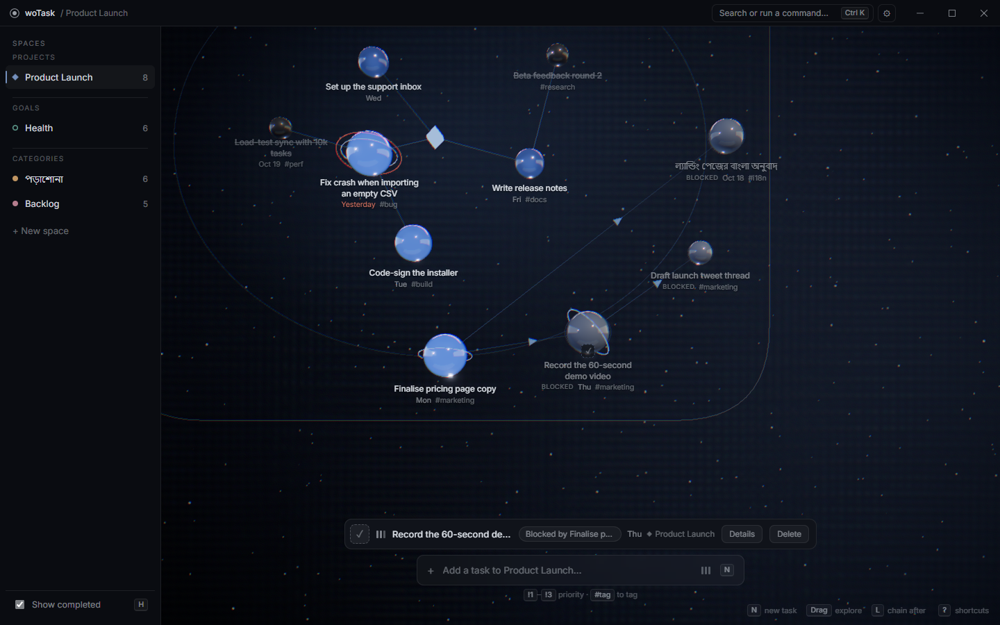
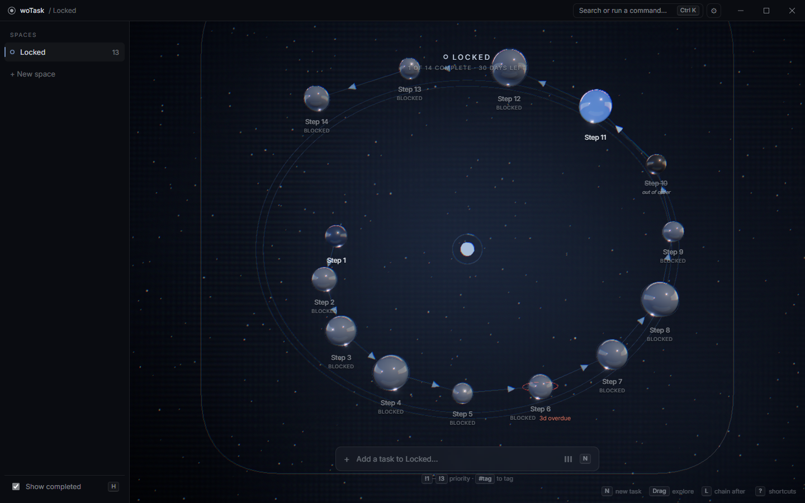

# woTask

A task manager that puts your work in space. Each project, goal or category becomes its own
constellation, and every task is a glass sphere floating inside it — sized and lit by priority,
coloured by the space it belongs to, and linked to whatever has to happen first.

Offline, local-first, and one small installer on Windows. No account, no sync, no telemetry.
Nothing ever leaves your machine.



---

## Download and install (Windows)

### 1. Download

Go to the [latest release](https://github.com/A-Piyas-04/woTask/releases/latest), open **Assets**,
and download:

**`woTask-0.1.0-windows-x64-setup.exe`**

That one file is the app. Ignore the rest — the two "Source code" files are added automatically by
GitHub and are not the app.

### 2. Install

Double-click it. It takes a few seconds and asks for no administrator rights.

> **Windows will warn about an unknown publisher.** The installer is not code-signed.
> Choose **More info → Run anyway**.

You get a **Desktop shortcut** and a **Start Menu entry**.

### 3. Open it

Click the woTask icon. Nothing is ever built, downloaded or set up again.

---

| | |
|---|---|
| **Needs** | 64-bit Windows, and Microsoft Edge WebView2 — already on most Windows 10 and 11 machines |
| **Offline** | No account, no internet, during install or after |
| **Update** | Run the new installer over the old one; your tasks are kept |
| **Uninstall** | Settings → Apps → Installed apps → woTask. Tasks stay in `%APPDATA%\woTask` |

## Why

Most task managers are lists. Lists are good at order and bad at shape — you cannot see that four
things are waiting on one decision, or that a project is top-heavy with urgent work, without reading
every row.

woTask trades the list for a spatial layout where those facts are visible at a glance:

- **Hue** tells you which space a task belongs to — and nothing else ever uses colour, except one
  alert red for overdue.
- **Size, brightness and surface** tell you its priority. The ordering survives in greyscale.
- **Position** tells you its order, and chained tasks wind outward from the centre as a visible
  sequence.
- **A frosted, caged sphere** is a task that is not your turn yet.

## Features

- **Spaces** — projects, goals and categories, each a zone of space with its own hue. Goals show a
  progress arc and a target date.
- **Chained tasks** — say that B comes after A. Chains branch, so finishing one task can release
  several. A blocked task is visibly locked, and completing one out of turn asks first rather than
  refusing.
- **Quick capture** — type `Pay rent !3 #bills`; the bar shows you what it parsed as you type.
- **Command palette** — `Ctrl+K` searches tasks, spaces and commands with fuzzy matching.
- **Full keyboard control** — every action has a shortcut, listed under `?`.
- **Undo** — `Ctrl+Z` on every change, including deleting a whole space.
- **Bangla and English** throughout, with IME-safe text entry.
- **Honest performance** — the canvas renders on demand, so an idle or unfocused window issues zero
  draw calls. Three graphics tiers for weaker GPUs.
- **Respects `prefers-reduced-motion`** — all motion stops, nothing breaks.

### Chains



- Tasks in a chain form a necklace around the space's hub.
- Chevrons and a brightness gradient show the direction from blocker to successor.
- Press `L` on a task to choose what it comes after.

## Running from source (developers)

**Prerequisites**

- [Node.js](https://nodejs.org/) 20.19+ or 22.12+
- [Rust](https://rustup.rs/) (stable) — only needed to build the desktop app
- Windows: the Microsoft Edge **WebView2 Runtime**, which ships with Windows 11 and recent Windows 10.
  woTask tells you if it is missing.

**In the browser, for development**

```bash
npm install
npm run dev          # http://localhost:1420
```

Data goes to `localStorage`, and a demo workspace is seeded automatically.

**As the desktop app**

```bash
npm run tauri dev    # development, with hot reload
npm run tauri build  # release build
```

Because `bundle.active` is `true` and `bundle.targets` is `["nsis"]` in
`src-tauri/tauri.conf.json`, `npm run tauri build` produces both:

- the bare binary, at `src-tauri/target/release/wotask.exe`
- the installer, at `src-tauri/target/release/bundle/nsis/woTask_<version>_x64-setup.exe`

The bare binary can be copied and run on its own as a portable app — it keeps its data in a
`woTask-data` folder beside itself. `npm run release:installer` builds the same thing for the
`x86_64-pc-windows-msvc` target, so its output sits under
`src-tauri/target/x86_64-pc-windows-msvc/release/` instead.

### Packaging the installer (maintainers)

**1. Build it on Windows.**

With the project dependencies and Windows Rust/C++ build tools already installed, run:

```bash
npm run release:installer
```

The command builds the Windows x64 binary, bundles the NSIS installer, runs the offline audit, and
writes these files (the current app version is `0.1.0`):

```text
release/
  woTask-0.1.0-windows-x64-setup.exe
  SHA256SUMS.txt
```

- The installer is about 2.3 MB. It excludes source code, build dependencies, personal data, and
  WebView2.
- Cargo runs offline, so a missing Rust dependency fails the build instead of downloading.
  The exception is the NSIS toolchain itself: the Tauri bundler fetches it once into the Tauri
  cache, so the **first** run of this command on a new machine needs network access.
- The installer is **not code-signed**, so Windows SmartScreen warns about an unknown publisher
  and users must choose *More info → Run anyway*. Signing needs a paid certificate. Repeat that
  warning in the release notes so the prompt does not look like a broken download.
- Generated files in `release/` are excluded from Git. Committing or tagging the source does not
  upload them to GitHub.

**2. Verify it.**

- Run the verification commands in **Development** below.
- On a Windows x64 machine with WebView2 and no development tools, with networking disabled:
  install, open the app, add tasks, close and reopen it, and confirm the tasks are still there.
- Confirm the Desktop shortcut, the Start Menu entry and the **Installed apps** entry appear.
- Run the new installer over the old one and confirm the tasks survive the upgrade.
- Uninstall, and confirm the app is gone but `%APPDATA%\woTask` still holds the database.

**3. Attach the files to the GitHub Release.**

1. Open the release on GitHub and click the **pencil icon** to edit it.
2. Attach these two local files in the release's asset upload area:
   - `release/woTask-0.1.0-windows-x64-setup.exe`
   - `release/SHA256SUMS.txt`
3. Save the release using **Update release**.
4. Reopen it and confirm that **Assets** lists the setup EXE and the checksum file alongside
   GitHub's two source-code archives.

The release title and tag do not change the app's internal version. Use a title and tag that match
the app version (for example `v0.1.0`) and describe the assets accurately in the release notes.

**Building the installer does not publish it automatically.** Once the asset is attached, regular
users can follow the install steps at the top of this README.

## Where your data lives

- **Storage:** a local SQLite database.
- **Installed copy:** `%APPDATA%\woTask`. Deliberately *outside* the install folder, which the
  installer replaces on upgrade and removes on uninstall.
- **Portable copy:** a `woTask-data` folder beside the executable, for an exe you built and copied
  yourself onto a Desktop or USB drive. The app tells the two apart by the `uninstall.exe` that
  only an installed copy has beside it.
- **Read-only location:** if the executable's folder is not writable, data goes to `%APPDATA%\woTask`.
- **Find the active location:** open **Settings → Data location**.
- **Upgrades:** database migrations create a backup beside the database first, such as
  `wotask.db.v2.bak`, and roll back if the integrity check fails.

## Keyboard

| | |
|---|---|
| `N` | New task |
| `Space` | Complete / reopen |
| `Enter` | Open details |
| `L` | Chain after… |
| `P` | Cycle priority |
| `Del` | Delete (undoable) |
| `↑` `↓` | Select previous / next |
| `Alt+↑` `Alt+↓` | Move among siblings, carrying the subtree |
| `Ctrl+←` `Ctrl+→` | Previous / next space |
| `Ctrl+1`…`9` | Jump to a space |
| `Ctrl+Shift+N` | New space |
| `Ctrl+Z` | Undo |
| `H` | Show / hide completed |
| `Ctrl+K` | Command palette |
| `Ctrl+,` | Settings |
| `?` | All shortcuts |

Drag to pan, scroll to zoom, double-click a sphere to open it, click a hub to switch space.

## Project layout

```
src/
  contracts/   Types, zod schemas and every design token. Treated as frozen.
  data/        Persistence. The only place the storage format is spoken.
  state/       One zustand store, plus pure selectors.
  scene/       React Three Fiber. Renders props; never reads the store.
  ui/          DOM chrome. All text and text entry lives here, never in WebGL.
  shared/      Formatting used by both layers.
src-tauri/     Rust: SQLite, migrations, window controls.
scripts/       Test and audit scripts (plain Node, no test framework).
docs/          Design notes.
```

Two rules shape most of this. Colours, motion timings and material parameters come only from
`src/contracts/tokens.ts`, so nothing is tuned in two places. And `src/scene/` never imports from
`src/data/` or `src/state/` — `src/app/App.tsx` is the single point where the store meets the scene.

For the reasoning behind the visual language — why priority avoids colour, how spheres are placed,
how chains are laid out and which two layouts failed first — see
[docs/SPHERE_DESIGN.md](docs/SPHERE_DESIGN.md).

## Development

```bash
npm run build          # tsc --noEmit + Vite build
npm run typecheck
npm run audit:offline  # fails if the frontend could reach the network
npm run test:chain     # unit tests for the chain and ordering selectors
npm run test:palette   # guards the space palette against drift
npm run test:ui        # end-to-end; needs `npm run dev` running
npm run test:visual    # pixel-level checks; needs `npm run dev` running
cd src-tauri && cargo test && cargo check
```

The browser tests drive the system's Edge through `playwright-core`, so there is no browser download
and the suite stays offline like the app.

**Dev fixtures.** Append `?seed=<name>` in development to load an isolated workspace:
`demo`, `none`, `priorities`, `states`, `dense60`, `reorder`, `many`, `chains`, `forks`,
`lockedDeep`, `stress`. Each uses its own storage slot, so it never touches your real data.

## Offline, for real

- `npm run audit:offline` checks the source and built frontend for remote asset URLs and network fetches.
- The Inter font is bundled locally.
- Lighting is generated from mesh lights; textures are drawn procedurally.
- No CDN links, remote fonts, HDRI downloads, or remote decoders are used.
- The Tauri security policy restricts connections to local app and IPC origins.
- The UI test checks that a full session makes zero external requests.

## Status

Version 0.1.0, and a personal project rather than a product. It works and it is tested, but the
contracts are still moving. Windows is the only platform currently built and tested.

## License

No licence has been chosen yet, which means default copyright applies: the code is public to read,
but not yet licensed for reuse. If you want to use any of it, open an issue and ask.
